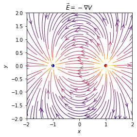

# Electric_Field_Simulation

### 前言
原本想說用「斜率場」來畫電力線，但光靠斜率場實在太不精確，也無法對應實際的數學意義，因此決定根據公式來撰寫電場模擬。
大部分數學原理及程式碼都是參考網路上的資源。
參考資源多樣，也包含電磁學課本，恕不逐一放上。
數學(物理)原理:http://163.28.10.78/content/vocation/control/tp_nh/ee/tp_nh/7/3.htm


```python
import numpy as np
import matplotlib.pyplot as plt
from matplotlib.patches import Circle
```

## 下列方法所使用公式為 

```python
def E(q, r0, x, y):
    """Return the electric field vector E=(Ex,Ey) due to charge q at r0."""
    den = np.hypot(x - r0[0], y - r0[1]) ** 3
    return q * (x - r0[0]) / den, q * (y - r0[1]) / den

```

* `np.hypot` 即是 


```python
# Grid of x, y points
nx, ny = 64, 64
x = np.linspace(-3, 3, nx)
y = np.linspace(-3, 3, ny)
X, Y = np.meshgrid(x, y)
```

## 決定電荷(charges)數量
設定`np`數量以決定模電荷子數量


```python
nq = 2 # the number of charges
charges = []
for i in range(nq):
    if i % 2 == 0:
        q = 1
    else:
        q = -1
    charges.append((q, (np.cos(2 * np.pi * i / nq), np.sin(2 * np.pi * i / nq))))
```

`charges`這個list物件所append的東西是:
[正負電荷(q) , ,]
也是決定電荷位置的關鍵!

## 先繪製出場(field)


```python
# Electric field vector, E=(Ex, Ey), as separate components
Ex, Ey = np.zeros((ny, nx)), np.zeros((ny, nx))
for charge in charges:
    ex, ey = E(*charge, x=X, y=Y)
    Ex += ex
    Ey += ey
    
fig = plt.figure()
ax = fig.add_subplot(111)

# Plot the streamlines with an appropriate colormap and arrow style
color = 2 * np.log(np.hypot(Ex, Ey))
ax.streamplot(x, y, Ex, Ey, color=color, linewidth=1, cmap=plt.cm.inferno,
              density=2, arrowstyle='->', arrowsize=1.5)
```


    <matplotlib.streamplot.StreamplotSet at 0x159d03e9730>


## 再繪製出點電荷


```python
# Add filled circles for the charges themselves
charge_colors = {True: '#aa0000', False: '#0000aa'}
for q, pos in charges:
    ax.add_artist(Circle(pos, 0.05, color=charge_colors[q > 0]))

ax.set_xlabel('$x$')
ax.set_ylabel('$y$')
ax.set_xlim(-2, 2)
ax.set_ylim(-2, 2)
ax.set_aspect('equal')

plt.show()
```

若想讓圖框比例自動調配可以將`ax.set_aspect('equal')`中的`'equal'`改成`'auto'`

## 完整程式


```python
import numpy as np
import matplotlib.pyplot as plt
from matplotlib.patches import Circle

def E(q, r0, x, y):
    """Return the electric field vector E=(Ex,Ey) due to charge q at r0."""
    den = np.hypot(x - r0[0], y - r0[1]) ** 3
    return q * (x - r0[0]) / den, q * (y - r0[1]) / den

# Grid of x, y points
nx, ny = 64, 64
x = np.linspace(-3, 3, nx)
y = np.linspace(-3, 3, ny)
X, Y = np.meshgrid(x, y)

nq = 2 # the number of charges
charges = []
for i in range(nq):
    if i % 2 == 0:
        q = 1
    else:
        q = -1
    charges.append((q, (np.cos(2 * np.pi * i / nq), np.sin(2 * np.pi * i / nq))))
    
# Electric field vector, E=(Ex, Ey), as separate components
Ex, Ey = np.zeros((ny, nx)), np.zeros((ny, nx))
for charge in charges:
    ex, ey = E(*charge, x=X, y=Y)
    Ex += ex
    Ey += ey
    
fig = plt.figure()
ax = fig.add_subplot(111)

# Plot the streamlines with an appropriate colormap and arrow style
color = 2 * np.log(np.hypot(Ex, Ey))
ax.streamplot(x, y, Ex, Ey, color=color, linewidth=1, cmap=plt.cm.inferno,
              density=2, arrowstyle='->', arrowsize=1.5)

# Add filled circles for the charges themselves
charge_colors = {True: '#aa0000', False: '#0000aa'}
for q, pos in charges:
    ax.add_artist(Circle(pos, 0.05, color=charge_colors[q > 0]))

ax.set_xlabel('$x$')
ax.set_ylabel('$y$')
ax.set_xlim(-2, 2)
ax.set_ylim(-2, 2)
ax.set_aspect('equal')
plt.show()
```


## 下列方法所使用公式為  


```python
def U(q, r0, x, y):
    """Return the electric field vector E=(Ex,Ey) due to charge q at r0."""
    den = np.hypot(x - r0[0], y - r0[1])
    return q / den


nq = 2
charges = []
for i in range(nq):
    if i % 2 == 0:
        q = 1
    else:
        q = -1
    charges.append((q, (np.cos(2 * np.pi * i / nq), np.sin(2 * np.pi * i / nq))))
    
U_array = np.zeros((nx, ny))    #set empty to '0'(or something)
for charge in charges:
    delta_U = U(*charge, x=X, y=Y)
    U_array += delta_U


Ey, Ex = np.gradient(-U_array)

fig = plt.figure()
ax = fig.add_subplot(111)

# Plot the streamlines with an appropriate colormap and arrow style
color = 2 * np.log(np.hypot(Ex, Ey))
ax.streamplot(x, y, Ex, Ey, color=color, linewidth=1, cmap=plt.cm.inferno,
              density=2, arrowstyle='->', arrowsize=1.5)

# Add filled circles for the charges themselves
charge_colors = {True: '#aa0000', False: '#0000aa'}
for q, pos in charges:
    ax.add_artist(Circle(pos, 0.05, color=charge_colors[q > 0]))

ax.set_xlabel('$x$')
ax.set_ylabel('$y$')
ax.set_xlim(-2, 2)
ax.set_ylim(-2, 2)
ax.set_aspect('equal')
ax.set_title('$ \\vec{E} =- \\nabla V $')
plt.show()

```





### 若要使電荷分佈於上下兩端，可交換和的位置
如下方程式


```python
import numpy as np
import matplotlib.pyplot as plt
from matplotlib.patches import Circle

# Grid of x, y points
nx, ny = 64, 64
x = np.linspace(-3, 3, nx)
y = np.linspace(-3, 3, ny)
X, Y = np.meshgrid(x, y)


def U(q, r0, x, y):
    """Return the electric field vector E=(Ex,Ey) due to charge q at r0."""
    den = np.hypot(x - r0[0], y - r0[1])
    return q / den


nq = 2
charges = []
for i in range(nq):
    if i % 2 == 0:
        q = 1
    else:
        q = -1
    charges.append((q, (np.sin(2 * np.pi * i / nq), np.cos(2 * np.pi * i / nq))))
    ''' sin and cos decide where the charges were placed '''
U_array = np.zeros((nx, ny))    #set empty to '0'(or something)
for charge in charges:
    delta_U = U(*charge, x=X, y=Y)
    U_array += delta_U


Ey, Ex = np.gradient(-U_array)

fig = plt.figure()
ax = fig.add_subplot(111)

# Plot the streamlines with an appropriate colormap and arrow style
color = 2 * np.log(np.hypot(Ex, Ey))
ax.streamplot(x, y, Ex, Ey, color=color, linewidth=1, cmap=plt.cm.inferno,
              density=2, arrowstyle='->', arrowsize=1.5)

# Add filled circles for the charges themselves
charge_colors = {True: '#aa0000', False: '#0000aa'}
for q, pos in charges:
    ax.add_artist(Circle(pos, 0.05, color=charge_colors[q > 0]))

ax.set_xlabel('$x$')
ax.set_ylabel('$y$')
ax.set_xlim(-2, 2)
ax.set_ylim(-2, 2)
ax.set_aspect('auto')
ax.set_title('$ \\vec{E} =- \\nabla V $')
plt.show()
```


